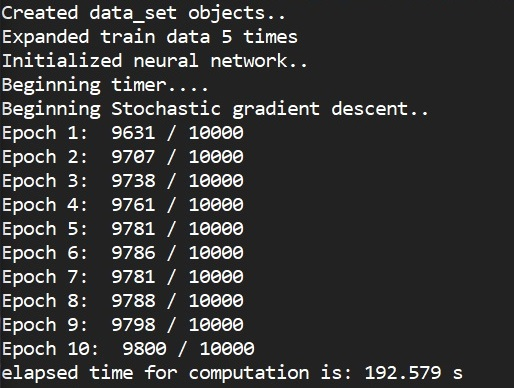

# Digit-Recognition-Neural-Network
An ANN written in C++ for classifying handwritten digits of the MNIST Dateset. Uses techniques of stochastic gradient descent, regularization, entropy cost, soft-max final layer, and data expansion to improve performance.

# Motivation
This project was written as part of a personal introduction to deep learning. C++ was chosen due to familiarity and interest in how the computational speed would compare with python code using Numpy. Eigen3 linked with intel MKL was used for opimized linear algebra routines. 

# Screenshots
Sample output of a training run of a 784 - 800 - 10 layer model, 30 image mini-batch size, 3.0 learning rate, 0.1 loss rate, and dataset expanded 5 times.

Example of the image rotation used to expand the dataset (in practice the angles are randomly drawn from normal distribution centered around 0)

Original 28x28 image: 

Image rotated by -14.22 degrees: 

# Dependencies
  - [Eigen3](http://eigen.tuxfamily.org/index.php?title=Main_Page)
  - [Intel MKL libraries](https://software.intel.com/content/www/us/en/develop/tools/math-kernel-library.html)
  
# Compiling
### Instructions 
Execute the Makefile in the root directory using the command "make"

### Notes
  - Makefile is written to use the GNU compiler
  - Eigen3 headers are expected in your systems standard include directories
    - E.g. /usr/include
  - Makefile assumes you have set the MKLROOT environment variable to the root of you Intel MKL install directory
  
  
